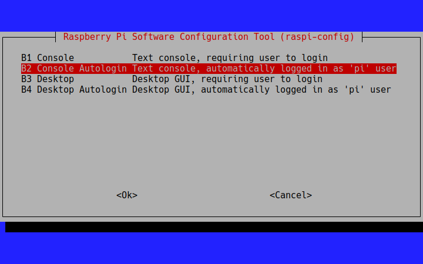

## Dependencies (pip)

- asyncio
- aiohttp
- sqlite3
- bleak
- pyyaml

## Getting Started

## 1. Install all dependencies

This includes updating BlueZ to v5.66 -- see [this page](https://lms.uibk.ac.at/auth/RepositoryEntry/5380538521/CourseNode/107744866999913) on OpenOLAT for a step-by-step guide.

## 2. Configure web server address and Access Point name

**Command:** `./configure`

**Note:** Web server address must be specified without `http(s)://`

## 3. Run the main script

**Command:** `python3 main.py`

## 4. Automatically run on startup of the Raspberry Pi
1. Using `raspi-config`, set the startup type to "Console Autologin".

2. Copy the contents of the [raspberry](raspberry) directory into `/srv/planthealth` on the Raspberry Pi.

3. Follow the instructions given in [planthealth.service](planthealth.service).

## Development

### Running the mock server

#### Dependencies (pip):

- flask

**Command:** `python3 mock_server/mock_rest.py`

### Running unit tests

**Command:** `python3 -m unittest tests/*.py`

## Troubleshooting

If database-related errors are shown in the console, delete `sensorstations.db` and restart `main.py`.
